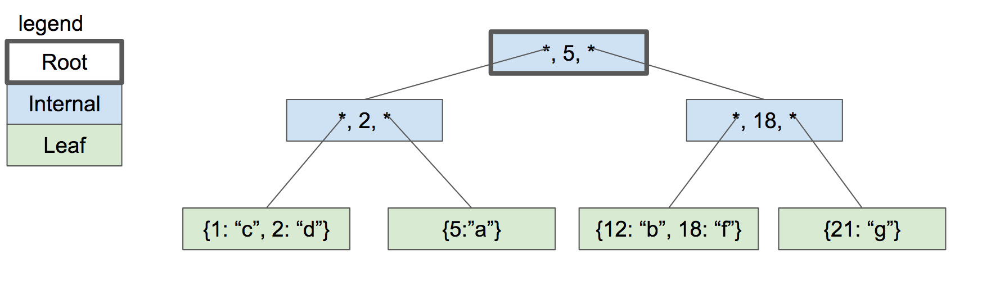
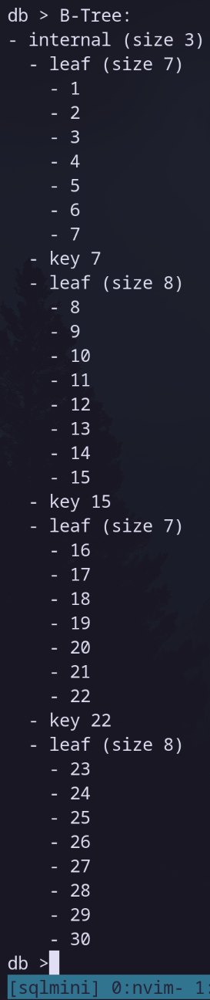

+++
title = "sqlmini"
description = "Database Management System inspired by SQLite"
date = 2026-04-24
updated = 2026-06-28
draft = false

[taxonomies]
tags = ["c", "db", "dbms"]

[extra]
images = ["btree-example-cstack-book.png", "sqlmini-tree-print.png"]
source = "https://codeberg.org/oraqlle/sqlmini"
+++

A Database Management System (DBMS) inspired by SQLite3 written in C.

Capable of the `INSERT` and `SELECT` SQL statements for a pre-determined row layout.
Stores a table across multiple memory pages to allow caching of visited rows and stores
pages in a B-Tree enabling efficient key lookup.

## Internal Tree Structure

The internal datbase stores the database contents in a B-Tree structure with the
following structure.

[Source: 'Part 7 - Introduction to the B-Tree'](https://cstack.github.io/db_tutorial/parts/part7.html)

This is what the an example tree looks like when printed out using the `.btree` meta
command.

## Credit

sqlmini is built following the online book ['Let's Build a Simple Database'](https://cstack.github.io/db_tutorial/)
written by [cstack](https://github.com/cstack).
